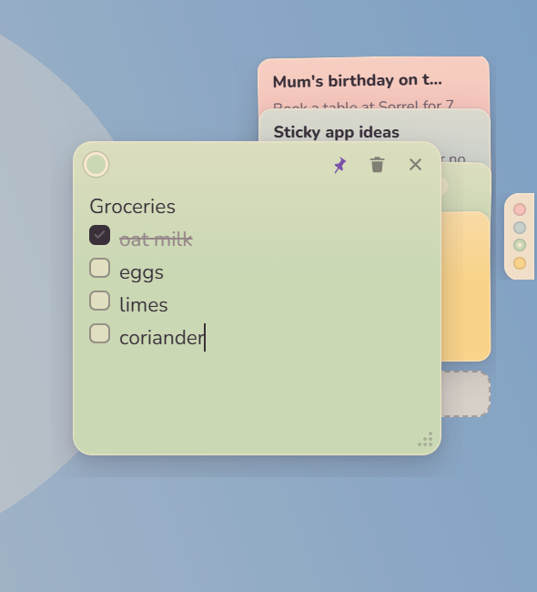
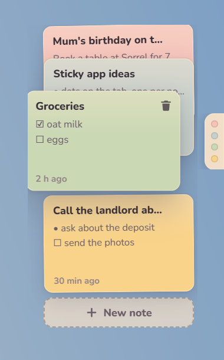
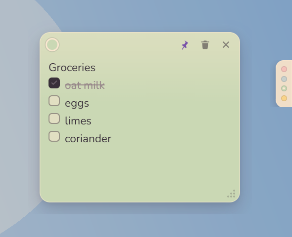

<p align="center">
  
</p>

<h1 align="center">Cute Sticky</h1>

<p align="center">
  A tiny always-on-top sticky notes dock for Windows 11.<br>
  A strip of dots on the right edge of your screen. Hover it, your notes deal out. Click one, it floats.
</p>

<p align="center">
  
</p>

## What it does

- **Stays out of the way.** All you see is a slim vertical tab of coloured dots, one per note, pinned to the right edge above every window. It never shows in the taskbar.
- **Hover to browse.** Rest the pointer on the tab and your notes deal out beside it as a pile of small cards. Hover a card and it slides out to peek while the cards below make room. Move away and they fold back.
- **Click to float.** A card, or a dot on the tab, opens the note as its own frameless window: drag it by the top edge, resize from the corner, pin or unpin it. It remembers where you left it and comes back there after a restart.
- **Write like paper.** Plain text with bullets and checkboxes. Type `- ` for a bullet and `[] ` for a checkbox; Enter continues the list, Backspace on an empty item leaves it. Six pastel colours. Everything saves as you type.
- **No dialogs.** Delete asks once, inline: the trash icon turns into "Delete?" for three seconds.
- **Always there.** Starts with Windows by default (switch it off from the tray) and keeps running while notes open and close.
- **Lightweight.** A 4.5 MB Rust executable around WebView2 and about 30 KB of JavaScript. Around 40 MB of memory while idle.

<p align="center">
  
  &nbsp;&nbsp;
  
</p>

## Install

Download the installer from the [latest release](https://github.com/SrinjoyDev/cute-sticky/releases/latest) and run it. It installs for the current user, no admin needed. Windows 11 ships the WebView2 runtime the app uses.

The tray icon gives you the rest: **New note**, **Hide tab** / **Show tab**, **Start with Windows**, and **Quit**.

## Build from source

You need [Node.js](https://nodejs.org) 22+, [Rust](https://rustup.rs) stable, and the Visual Studio Build Tools 2022 with the _Desktop development with C++_ workload.

```powershell
git clone https://github.com/SrinjoyDev/cute-sticky
cd cute-sticky
npm install
npm run tauri dev      # run with hot reload
npm run tauri build    # produces src-tauri/target/release/bundle/nsis/*.exe
```

Tests: `npm test` covers the editor model and pile layout; `cargo test` in `src-tauri` covers the store and window geometry. See [CONTRIBUTING.md](CONTRIBUTING.md) for the full check list and notes on developing from WSL.

## How it works

Three kinds of window, all frameless and transparent, drawn with CSS:

| window      | what it is                                                                                                                                                                                                            |
| ----------- | --------------------------------------------------------------------------------------------------------------------------------------------------------------------------------------------------------------------- |
| `tab`       | The 22 px strip of dots. Never takes focus. Reports hover to Rust; click a dot to open, drag to move.                                                                                                                 |
| `pile`      | Created hidden. Rust sizes it to the note count, places it beside the tab, and shows it when the hover state machine says so. The page deals the cards in with a stagger and folds them back before the window hides. |
| `note-<id>` | One per open note, created on demand at its saved rectangle. Always on top while pinned.                                                                                                                              |

Rust owns the state. Notes and settings live in one JSON file (`%APPDATA%\com.srinjoy.cutesticky\notes.json`) written atomically and debounced; a file that fails to parse is moved aside rather than overwritten. Every mutation broadcasts a `notes-changed` event so all windows stay in sync.

Two Windows details worth knowing if you hack on it: commands that create windows are `async`, because a synchronous command blocks the thread the new webview needs to initialise; and the tab and pile windows are switched to plain popup style after creation, because Windows forces caption-style windows to a minimum width of about 132 px.

The layout math (`geometry.rs`) and the editor model (`model.ts`) are pure functions with tests. The pages are plain TypeScript with no framework.

The interaction design came from an [interactive HTML mockup](docs/mockups/cute-sticky-mockup.html) on a simulated desktop; open it in a browser to walk through every stage. The design document is in [docs/superpowers/specs](docs/superpowers/specs/2026-09-03-cute-sticky-design.md).

## Roadmap

Things that would fit without making it heavier:

- Keyboard shortcut to make a new note from anywhere
- Multi-monitor placement
- Search across notes from the pile
- Export notes as Markdown files

Sync, rich text, and accounts are out of scope on purpose.

## Licence

[MIT](LICENSE)
